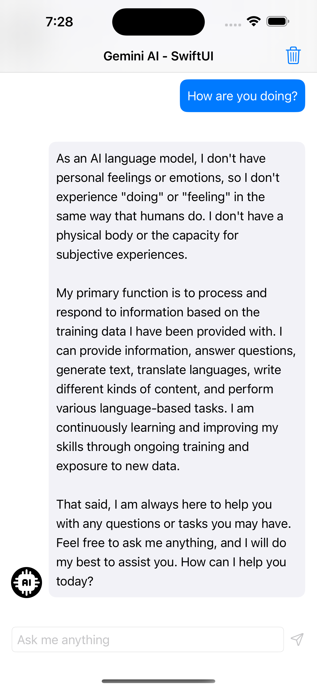

## Implementation of Google Gemini AI API with iOS using SwiftUI

Learn how to use Google Gemini AI API in iOS using SwiftUI. This chat app starter template will help you to build an ai chat app easily. 

Get basic idea from here: [Gemini AI on iOS with SwiftUI](https://devswiftly.com/gemini-ai-on-ios-with-swiftui/)

This app store chat history in core data. User will able to clearn chat history too.  
## Here is the screenshot of the app:

